# 📊 Statistical Analysis with SPSS  
### Author: Fostiropoulou Despoina

This repository contains the SPSS statistical analysis project completed as part of the postgraduate course **“Statistical Analysis Tools”**.  
The project includes:

- SPSS syntax files  
- Statistical outputs (P-P plots, Q-Q plots, tables, tests)  
- Interpretation and analysis of results  
- Visual material for each section  

---

## 📌 Project Overview

The purpose of this project is to perform a complete statistical analysis on a dataset using **IBM SPSS Statistics**, applying both parametric and non‑parametric methods.  
The analysis includes:

- Normality checks  
- Hypothesis testing  
- Independence tests  
- ANOVA  
- Correlation analysis  
- Simple linear regression  

Each section below includes a short explanation and a placeholder for the corresponding images.

---

## 1️⃣ P‑P Plots & Q‑Q Plots (Normality Check)

This section examines whether the quantitative variables follow a normal distribution using **P‑P** and **Q‑Q** plots.

Variables tested:
- Age  
- Years of Experience  
- Current Salary  

**Conclusion:**  
All three variables visually follow a normal distribution, as their values align closely with the diagonal reference line.

**Images:**  
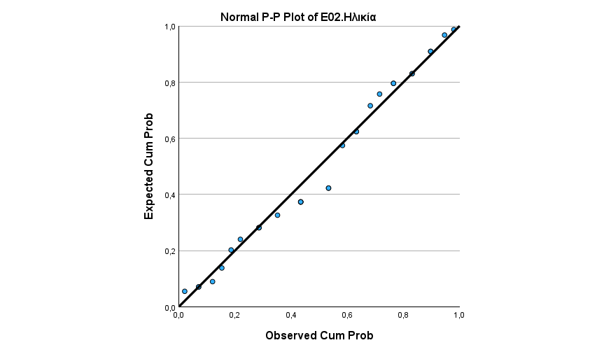 
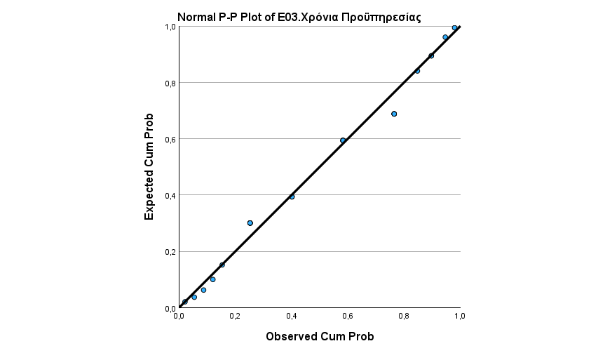 
 
 
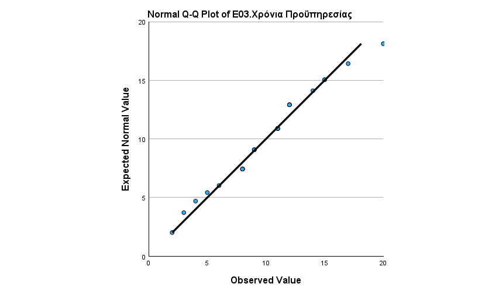 
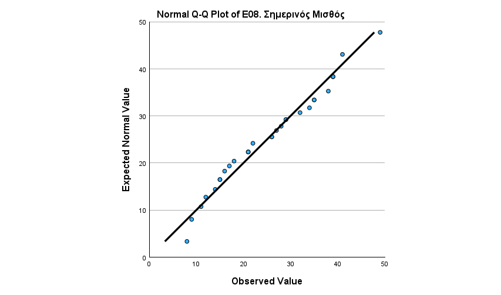 

---

## 2️⃣ Kolmogorov–Smirnov Normality Test

A formal normality test was performed for the same quantitative variables.

**Hypotheses:**  
- H0: The data follow a normal distribution  
- H1: The data do not follow a normal distribution  

**Conclusion:**  
All p‑values > 0.05 → **H0 is accepted**.  
The variables follow a normal distribution.

**Image:**  
 

---

## 3️⃣ One‑Sample T‑Test

Two tests were performed to compare the sample’s annual salary with:

1. The European average salary (22,000€)  
2. The Greek average salary (10,000€)

**Results:**  
- Comparison with 22,000€ → p > 0.05 → **No significant difference**  
- Comparison with 10,000€ → p < 0.05 → **Significant difference**

**Images:**  
 
 
 
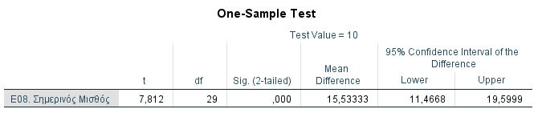 

---

## 4️⃣ Chi‑Square Test of Independence

Tested whether **Gender** is associated with:
- Having experienced bullying  
- Having been a bully  

Due to low expected frequencies, variables were recoded into binary categories.

**Conclusion:**  
In both cases, p > 0.05 → **No association** between gender and bullying-related variables.

**Images:**  
 
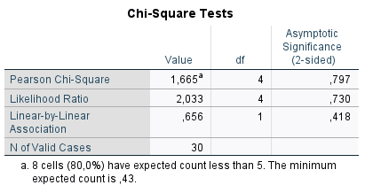 
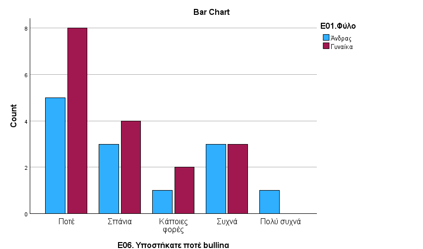 
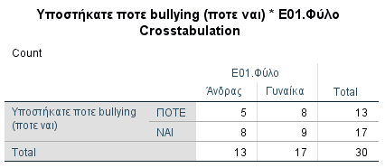 
 
 
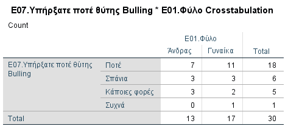 
 
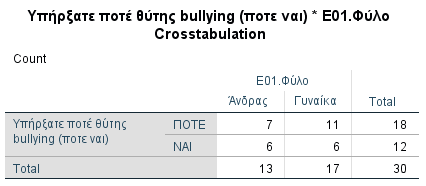 
 
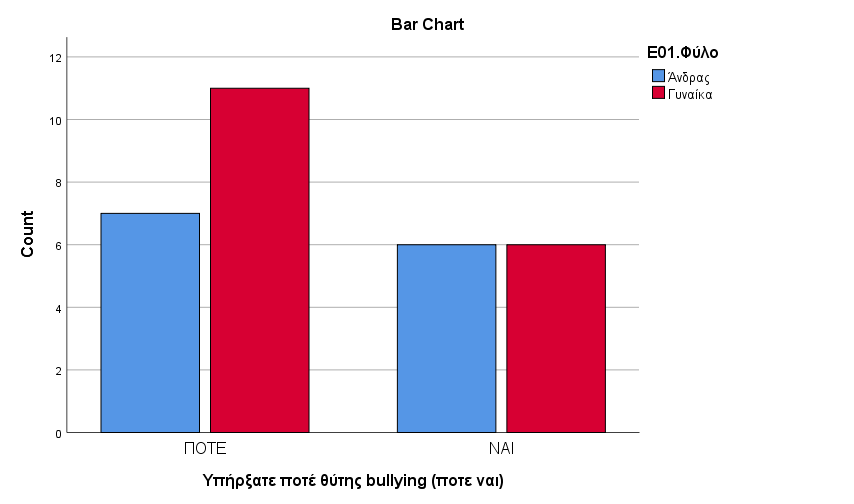 

---

## 5️⃣ One‑Way ANOVA

Tested whether annual income differs based on:
- Employment type  
- Marital status  

**Conclusion:**  
All p‑values > 0.05 → **No statistically significant differences**.

**Images:**  
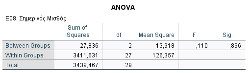 
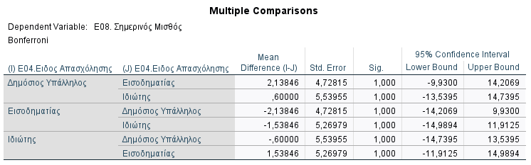 
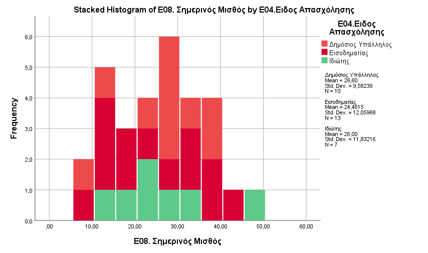 
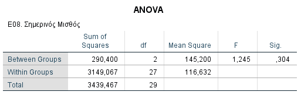 
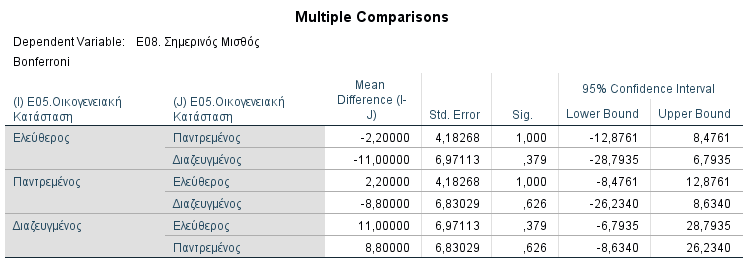 

---

## 6️⃣ Independent Samples T‑Test

Compared the mean annual salary between **men** and **women**.

**Conclusion:**  
p > 0.05 → **No significant difference** in salary based on gender.

**Image:**  
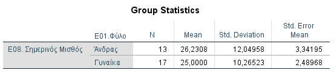 
 

---

## 7️⃣ Pearson Correlation

Tested the linear relationship between:
- Age  
- Current Salary  

**Conclusion:**  
Pearson r = −0.259, p > 0.05 → **No linear correlation**.

**Image:**  
 

---

## 8️⃣ Simple Linear Regression

Regression model predicting **Current Salary** based on **Years of Experience**.

Model:  

\[
Y = a + bX = 16.044 + 0.943X
\]

Prediction for 30 years of experience:  

\[
Y = 44.334
\]

**Conclusion:**  
Experience has a positive effect on salary, though the strength of the relationship depends on the dataset.

**Image:**  
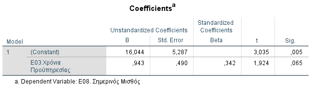 
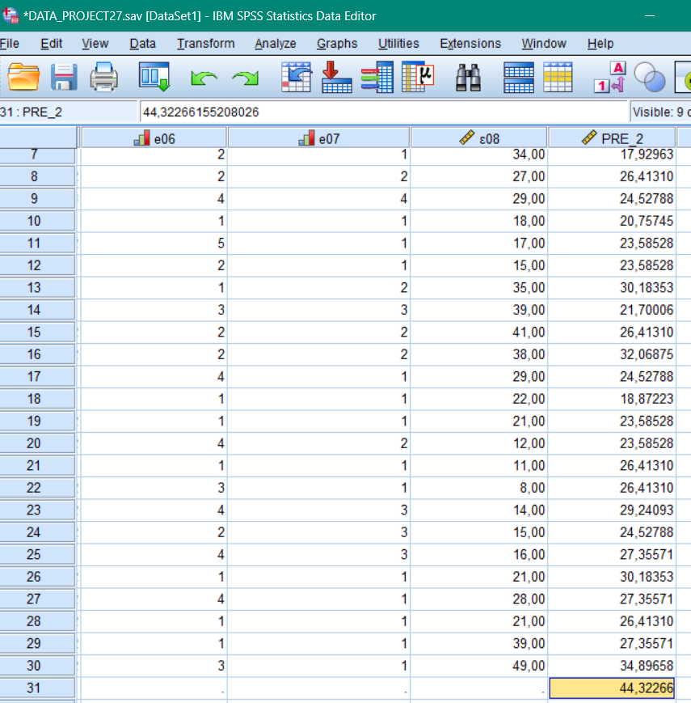 
